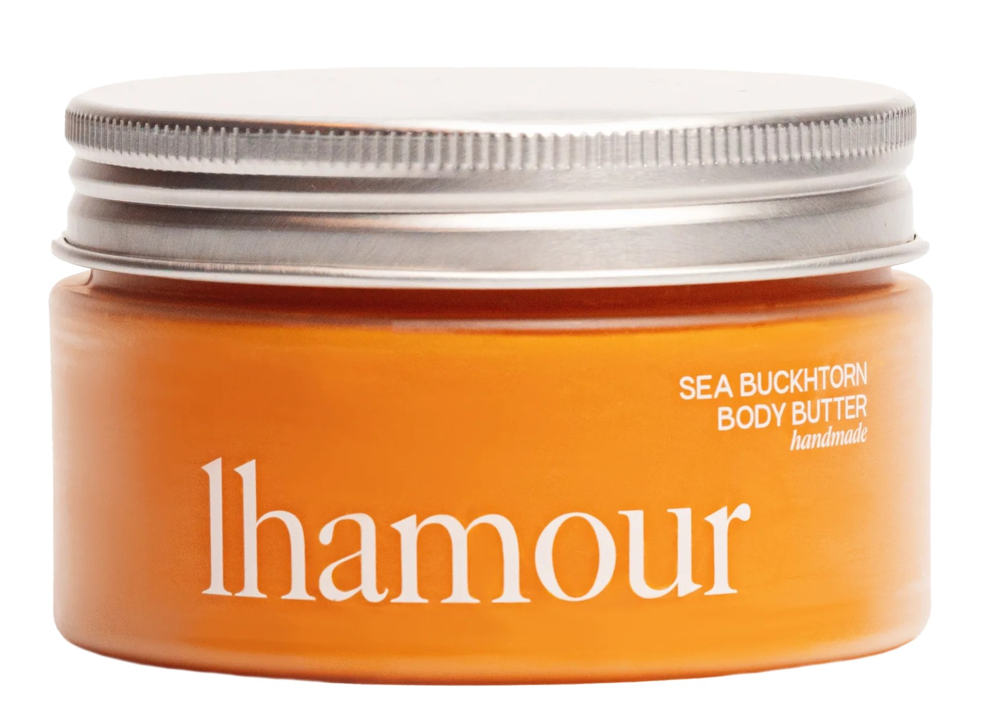
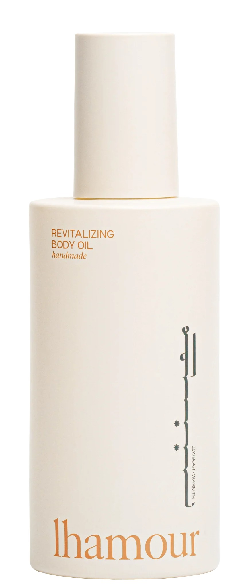

Let’s face it: we all want to smell fresh and fabulous from morning to night. Whether it’s for a date, a long workday, or just to feel good about yourself, staying fragrant is a confidence booster. Here’s how to master the art of smelling good all day long—the easy, fun way!

*Disclaimer: Some of the links in this post are affiliate links. If you make a purchase through these links, I may earn a small commission at no extra cost to you. Your support helps me continue to create content and share valuable resources with you!* 

# 1. Start with a Good Shower Routine

Your journey to smelling amazing begins in the shower. Make it count!

- **Use a Scented Body Wash:** Opt for trending options like Sol de Janeiro’s Brazilian 4 Play Moisturizing Shower Cream-Gel or OGX Coconut Coffee Scrub and Wash for a creamy, invigorating cleanse.
- **Exfoliate Regularly:** Dead skin can trap odors. Gently scrub with Tree Hut’s Moroccan Rose Shea Sugar Scrub to keep your skin fresh and soft.
- **Don’t Skip Your Hair:** Use a shampoo and conditioner that smells divine, like the Olaplex No.4 Bond Maintenance Shampoo paired with No.5 Conditioner.

  

    
  

  

    
  

***Disclaimer: Some of the links or references on this page may contain images of women. We kindly advise our brothers in faith to avoid clicking on them, so that their nazar may remain in ḥifāẓat (protection). By placing this note, we intend to keep ourselves free from any blame. If one still chooses to proceed, the responsibility lies with them alone.***

# 2. Hydrate Your Skin

Dry skin doesn’t hold onto scents as well as hydrated skin. Moisturize, moisturize, moisturize!

- **Apply Lotion Right After Showering:** Lock in moisture with [**Lhamour's Natural Sea Buckthorn Oil Body Butter**](https://www.lhamour.com/products/natural-sea-buckthorn-oil-body-butter?sca_ref=8121337.DCmZafggw7) or [**Revitalizing Body Oil**](https://www.lhamour.com/products/natural-revitalizing-body-oil?sca_ref=8121337.DCmZafggw7). These handcrafted, organic blends from Mongolia are packed with antioxidants and free from synthetic additives — meaning your skin gets pure, lasting hydration without the hidden toxins. Customers love how lightweight yet deeply nourishing they are, with many calling them “the best body oil ever tried.” 🌿 Plus, each order comes with a free gift, making it an irresistible upgrade to your daily self-care.
- **Layer Scents for Longevity:** Match your body wash and lotion scents if possible, or choose complementary fragrances.

  

    
    

    <a href="https://www.lhamour.com/products/natural-sea-buckthorn-oil-body-butter?sca_ref=8121337.DCmZafggw7">
      🔗 Lhamour Natural Sea Buckthorn Oil Body Butter
    </a>
  

  

  

    
     

    <a href="https://www.lhamour.com/products/natural-revitalizing-body-oil?sca_ref=8121337.DCmZafggw7">
      🔗 Lhamour Revitalizing Body Oil
    </a>
  

  

# 3. Use a Long-Lasting Deodorant

Nobody wants to deal with mid-day underarm panic. Choose something reliable!

- **Go for Fan Favorites:** For odor control and skin care, try Native’s Coconut & Vanilla Deodorant or the hype-worthy Kosas Chemistry AHA Serum Deodorant.
- **Reapply When Needed:** Travel-sized options can be lifesavers.

  

    
  

# 4. Keep Your Clothes Fresh

Fresh-smelling clothes make a big difference. Here’s how to ensure your wardrobe contributes to your all-day freshness:

- **Use Scent Boosters in Your Laundry:** Add a capful of Downy Unstopables or Gain Fireworks Scent Beads to your laundry for long-lasting freshness.
- **Store Clothes with Scented Sachets:** Place lavender or cedar sachets in your drawers and closet to keep clothes smelling clean.
- **Air Out Your Clothes:** If you’ve been in a stuffy environment, hang your outfit outside for a few minutes to freshen it up.

  

    
  

  

    
  

# 5. Bonus Tips for Staying Fresh

Here’s where you take things up a notch:

- **Keep Freshening Wipes Handy:** Use body wipes when you need a quick refresh.
- **Stay Hydrated:** Drinking water helps your body stay fresh from the inside out. Trust us, it works!
- **Eat Fresh Foods:** Fruits and vegetables can help your body emit a more pleasant natural scent.
- **Change Socks and Undergarments Midday:** This small change can make a big difference, especially on busy days.

Smelling good all day isn’t rocket science, but it does require a bit of effort. With these tips and some products, you’ll be turning heads (in the best way) in no time. Go ahead, embrace your inner fragrance queen (or king)!

What’s your favorite way to stay fresh? Let us know in the comments below!