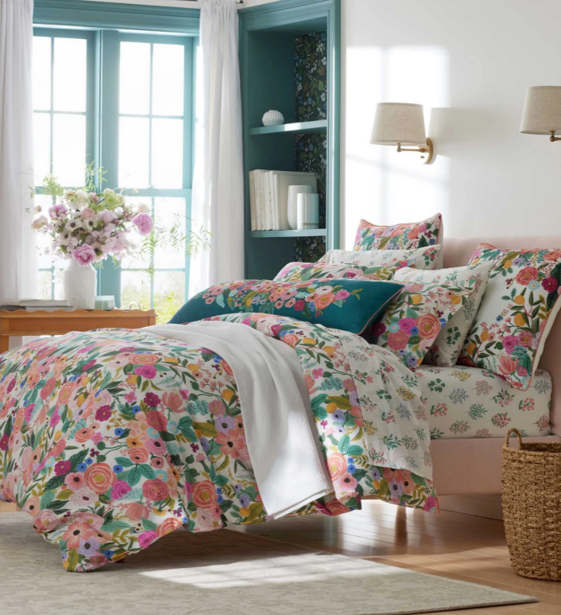
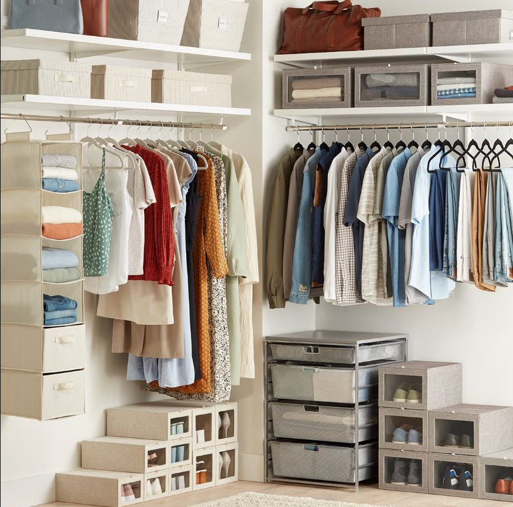
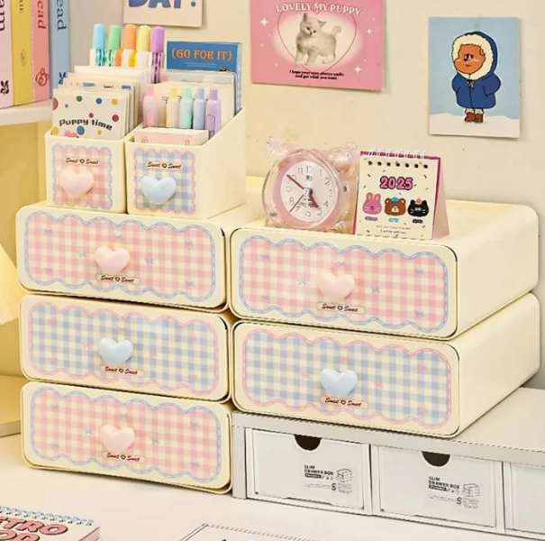
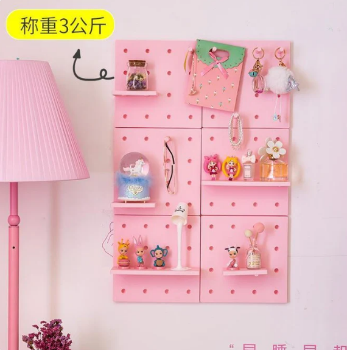
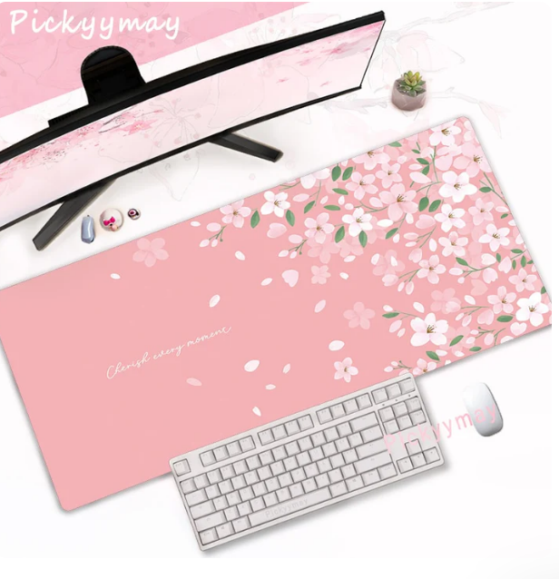

You know that specific kind of pain where you're lying in your room, looking at the ceiling, and thinking *why does this space feel so blah?* You scroll through Pinterest for ten minutes. Suddenly you want to repaint everything, buy new furniture, and install some kind of fairy light situation. Then you check your wallet and remember you're a real person.
 
Good news: your room can go from "just a place I sleep" to "a place I actually want to be in" without a complete financial breakdown. I've pulled together the cheapest, most effective room makeover ideas that genuinely work, and everything linked here is from boycott-safe, halal-friendly sources, meaning no animals, no cartoon imagery, just clean aesthetics you can feel good about.
 
*Heads up: Some links in this post are affiliate links. If you buy through them, I may earn a small commission at no extra cost to you. Your support keeps this blog going.*

***Disclaimer: Some external product pages may contain images of women. Brothers in faith, please proceed with caution. Responsibility lies with the individual.***

---
 
## Start Here: The Cheap Room Makeover Mindset
 
Before you buy anything, do a five-minute edit. Pull everything off your desk and shelves. Stand in the doorway and look at your room like a stranger. What's visually noisy? What's missing? Most rooms don't need more stuff - they need better stuff in the right places.
 
That said, a few intentional additions go a long way. Here's what actually moves the needle.
 
---

## 1. Wall Art and Decor That Does the Heavy Lifting
 
Bare walls are the fastest way to make a room feel unfinished. The fix doesn't have to be expensive or complicated.
 
- **[Washi tape](https://shopmy.us/shop/collections/2945333)is underrated.** Seriously. You can create geometric borders, frame a mirror, or build a whole gallery wall layout before committing to anything. It peels off clean. From my shop, the **[ChicChoi Kitchen Accessories Washi & Pet Tape](https://go.shopmy.us/p-31704073)** and **[Coffee Moments Washi Tape](https://go.shopmy.us/p-31704063)** are lovely for a warm, food-themed aesthetic. If you're going for something more botanical, the **[Rifle Paper Co. Wax Seal Set](https://go.shopmy.us/p-50375419)** is a gorgeous little touch that makes DIY letters and journals feel luxurious.
 

  

    
    
<a href="https://go.shopmy.us/p-31704073" target="_blank" rel="noopener noreferrer">🔗 Shop Kitchen Accessories Washi & Pet Tape →</a>

  

  

    
    
<a href="https://go.shopmy.us/p-31704063" target="_blank" rel="noopener noreferrer">🔗 Shop Coffee Moments Washi Tape →</a>

  

- **Wall stickers work if you pick the right ones.** Avoid anything with characters or animals as a muslim (my shop keeps things clean on that front). Geometric shapes, florals, and abstract patterns all read as elevated when framed right.
 
- **A real print or canvas, even a small one, changes a wall.** If you want something meaningful the **[Art Print "Who Says" from Simplified](https://go.shopmy.us/p-26107967)** is clean, text-based, and under $25. No figures, no animals, just a sentiment.
 

  

    
    
<a href="https://go.shopmy.us/p-26107967" target="_blank" rel="noopener noreferrer">🔗 Shop Art Print "Who Says" →</a>

  

- **Floating shelves are wall decor AND storage.** If you're choosing between shelves or art, choose shelves and style them. I have a whole collection of floating shelf options from AllModern and Anthropologie in my shop's **[Floating Shelf collection](https://shopmy.us/shop/collections/2888805)**. The **[All Modern Cubist Accent Shelf](https://go.shopmy.us/p-36652228)** is particularly beautiful for soft aesthetic under $30.

  

    
    
<a href="https://go.shopmy.us/p-36652228" target="_blank" rel="noopener noreferrer">🔗 Shop AllModern Cubist Accent Shelf →</a>

  

 
For more wall styling ideas, my **[Cozy Bedroom Aesthetic](https://petallifestyle.pages.dev/posts/eclectic-boho-bedroom-ideas-design-your-space-with-vintage-bohemian-and-modern-touches/)** post has a lot of inspo for how to layer decor without things looking cluttered.
 
---

## 2. Lighting Is Everything and Most People Get It Wrong
 
Here's the thing about lighting: overhead lighting is almost always ugly. It makes every room feel like a hospital waiting room. The fix is layering.
 
**Add at least one warm light source that isn't your ceiling.** Options at every budget:
 
- **[Tulip Night Light](https://go.shopmy.us/p-52933047)** and **[Cute Star Led Plug-In Night Light](https://go.shopmy.us/p-52784207)** are under $25 and wildly charming.

- The **[Tulips LED Chargeable Table Lamp](https://go.shopmy.us/p-52784280)** is portable, which means you can move it wherever the room needs it most.

  

    
    
<a href="https://go.shopmy.us/p-52933047" target="_blank" rel="noopener noreferrer">🔗 Shop Tulip Night Light →</a>

  

  

    
    
<a href="https://go.shopmy.us/p-52784207" target="_blank" rel="noopener noreferrer">🔗 Shop Cute Star Led Plug-In Night Light →</a>

  

  

    
    
<a href="https://go.shopmy.us/p-52784280" target="_blank" rel="noopener noreferrer">🔗 Shop Tulips LED Chargeable Table Lamp →</a>

  

**LED strips behind furniture** (your bed headboard, your desk, your bookshelf) create that ambient glow that makes everything look more expensive. The effect is dramatic for very little money.
 
**Rotating projector night lights** are having a moment and honestly? They earn it. The **[Rotating Projector LED Night Light](https://go.shopmy.us/p-52785280)** casts patterns across your ceiling and walls and turns your room into something that feels genuinely magical.
 
One thing I'll say about aesthetic lighting: it works best when you turn off the overhead light first. Give your eyes five minutes to adjust and suddenly your room feels like a completely different space.
 
---

## 3. Throw Pillows and Textiles: The Quickest Vibe Shift
 
Pillows are doing a lot of work in any well-styled room. They add color, texture, softness, and personality, and they're one of the easiest things to swap out seasonally.
 
The key is **not buying too many** (a common mistake) and choosing designs that don't feature animals or characters, which keeps things halal-friendly and honestly, more timeless.
 
What works well:
 
- Solid colors in your palette
- Geometric or abstract prints
- Textured fabrics like boucle, waffle knit, or quilted cotton
- Nature-inspired patterns (leaves, botanicals, florals)

The **[Flower Plushies](https://go.shopmy.us/p-50689486)** and **[Moon and Star Plushie Pillows](https://go.shopmy.us/p-28457968)** are soft, adorable, and completely free of cartoon characters or animal faces.

  

    
    
<a href="https://go.shopmy.us/p-50689486" target="_blank" rel="noopener noreferrer">🔗 Shop Flower Plushies →</a>

  

  

    
    
<a href="https://go.shopmy.us/p-28457968" target="_blank" rel="noopener noreferrer">🔗 Shop Moon and Star Plushie Pillows →</a>

  

 
If you want something more structured and adult-looking, check out the [bedding collections](https://shopmy.us/shop/collections/2432818). It has several bedding sets, including the **[Percale Duvet Cover in Garden Party](https://go.shopmy.us/p-26132664)** and the **[The Printed Cotton-Slub Duvet](https://go.shopmy.us/p-37184975)**. Floral patterns, clean backgrounds, genuinely beautiful.
 

  

    
    
<a href="https://go.shopmy.us/p-37184975" target="_blank" rel="noopener noreferrer">🔗 Shop Anthropologie Printed Cotton-Slub Duvet →</a>

  

  

    
    
<a href="https://go.shopmy.us/p-26132664" target="_blank" rel="noopener noreferrer">🔗 Shop Rifle Paper Co. Garden Party Duvet →</a>

  

 
---

## 4. Smart Storage That Looks Good
 
Here's a truth nobody says out loud: clutter is the number one thing making your room feel bad. It's not the furniture, it's not the color of the walls. It's that your stuff has nowhere to live and so it lives on every surface.
 
**Baskets are your best friend.** They hide things that don't photograph well, they look intentional, and they come in enough varieties to fit any aesthetic. [Retro Chic Felt Fabric Storage Box](https://go.shopmy.us/p-31711541)or [Cambridge Shirt Box Black](https://go.shopmy.us/p-50365005)work for boho, minimal, and soft aesthetic rooms.

  

    
    
<a href="https://go.shopmy.us/p-31711541" target="_blank" rel="noopener noreferrer">🔗 Shop Retro Chic Felt Fabric Storage Box →</a>

  

  

    
    
<a href="https://go.shopmy.us/p-50365005" target="_blank" rel="noopener noreferrer">🔗 Shop Cambridge Shirt Box Black work →</a>

  

 
**Under-bed storage is underused.** A few flat storage boxes under your bed and suddenly you have a whole extra closet.
 
**Desk organizers for your surfaces.** If your desk looks chaotic, your brain feels chaotic. The **[Make Your Lobda Desk Organizer](https://go.shopmy.us/p-29883080)** and **[Pastel Gingham Desktop Stationery Organizer](https://go.shopmy.us/p-52778143)** are genuinely functional and look good. The **[Wall Peg Board and Shelf Kit](https://go.shopmy.us/p-52780479)** is particularly smart for small rooms since it gets things off horizontal surfaces entirely.

  

    
    
<a href="https://go.shopmy.us/p-29883080" target="_blank" rel="noopener noreferrer">🔗 Shop Make Your Lobda Desk Organizer →</a>

  

  

    
    
<a href="https://go.shopmy.us/p-52778143" target="_blank" rel="noopener noreferrer">🔗 Shop Pastel Gingham Desktop Organizer →</a>

  

  

    
    
<a href="https://go.shopmy.us/p-52780479" target="_blank" rel="noopener noreferrer">🔗 Shop Wall Peg Board and Shelf Kit →</a>

  

 
**Multi-use furniture is where the real savings are.** A storage stool at the end of your bed gives you seating and hidden storage. A bed with built-in drawers eliminates your need for a dresser. I have both in my shop, and they're worth looking at if you're doing a bigger overhaul.
 
Related read: **[How to Create a Cozy Reading Corner](https://petallifestyle.pages.dev/posts/how-to-create-a-cozy-reading-corner-thats-pure-bliss/)** has great ideas for making a small corner feel purposeful.
 
---
 
## 5. Mirrors: Small Investment, Huge Visual Return
 
A well-placed mirror does three things: makes the room look bigger, bounces light around, and gives you somewhere to check your outfit. All wins.
 
The **[Joss and Main Arranjeet Mirror](https://go.shopmy.us/p-53167107)** is lovely and cheap. For something more budget-conscious, the **[Mirrors collection](https://shopmy.us/shop/collections/2431745)** has several AllModern options.
 

  

    
    
<a href="https://go.shopmy.us/p-53167107" target="_blank" rel="noopener noreferrer">🔗 Shop Joss and Main Arranjeet Mirror →</a>

  

Placement matters more than the mirror itself. Put it across from a window so it reflects natural light, or lean it against a wall at an angle if you don't want to drill.
 
---
 
## 6. DIY Ideas That Are Actually Worth Your Time
 
Not everything needs to be bought. A few free or near-free updates that genuinely work:
 
**Rearrange your furniture.** It costs nothing and changes everything. Try your bed on a different wall. Angle your desk toward the window. Move the bookshelf to create a reading nook.
 
**Make a gallery wall with things you already own.** Print photos at a pharmacy. Frame in matching thrift-store frames. Arrange in a grid. Simple, personal, free.
 
**Style your bookshelf intentionally.** Books spine-out, some spine-in for texture, a small vase, one candle, one decorative object per shelf. The **[Anthrohome Nova Ceramic Tulipere Vase](https://go.shopmy.us/p-43354731)** and the **[Anthrohome Claire Clear Glass Bud Vase](https://go.shopmy.us/p-43354682)** are both small, beautiful, and affordable.
 

  

    
    
<a href="https://go.shopmy.us/p-43354731" target="_blank" rel="noopener noreferrer">🔗 Shop Nova Ceramic Tulipere Vase →</a>

  

  

    
    
<a href="https://go.shopmy.us/p-43354682" target="_blank" rel="noopener noreferrer">🔗 Shop Claire Clear Glass Bud Vase →</a>

  

**Washi tape picture frames.** Print a quote or photo, tape it directly to the wall in a washi tape border. Looks deliberate, completely removable, costs almost nothing.
 
---
 
## 7. The Desk Situation (Because Most of Us Spend a Lot of Time There)
 
If you work or study from your room, your desk vibe matters. A chaotic desk leaks into how the whole room feels.
 
The fastest desk refresh:
 
1. Clear everything off. Start from zero.
2. Add one piece of quality lighting (a small lamp, not just your laptop screen).
3. Use a desk mat or mouse pad to define the work zone visually.
4. Add a pen holder that looks good, not just functional.
5. Keep only what you use daily on the surface.

The **[Cherry Blossom Desk Pad](https://go.shopmy.us/p-50752965)** anchors a whole desk instantly with a beautiful floral print. The **[Lofree Jelly Palm Rest](https://go.shopmy.us/p-36839846)** is a small, surprisingly satisfying addition if you type a lot. For keyboards, my **[Keyboards collection](https://shopmy.us/shop/collections/2431818)** has typewriter-style options in cream, pink, matcha green, and white.
 

  

    
    
<a href="https://go.shopmy.us/p-50752965" target="_blank" rel="noopener noreferrer">🔗 Shop Cherry Blossom Desk Pad →</a>

  

  

    
    
<a href="https://go.shopmy.us/p-36839846" target="_blank" rel="noopener noreferrer">🔗 Shop Lofree Jelly Palm Rest →</a>

  

My **[Aesthetic Desk Setup Ideas for Students (Under $100)](https://shopmy.us/shop/collections/4654152)** ShopMy collection has everything curated in one place.
 
Also worth reading: **[Kawaii Home Office Decor Ideas (Muslim-Friendly)](https://petallifestyle.pages.dev/posts/kawaii-home-office-decor-ideas-muslim-friendly-cute-productive-workspace-tips/)** and **[Essentials for an Aesthetic Home Office](https://petallifestyle.pages.dev/posts/essentials-for-an-aesthetic-home-office/)**.
 
---
 
## A Note on Where Everything Comes From

 
Everything linked in this post comes from brands that are boycott-safe. All products are animal-free and cartoon-free in their imagery, keeping things halal-friendly by design. My shop pulls from merchants including ChicChoi, AllModern, Anthropologie, Rifle Paper Co., Joss and Main, Simplified, and so on.

---
 
## The Short Version
 
You don't need a renovation. You need a few intentional changes: one good light source that isn't overhead, one mirror, baskets for the clutter, something on the walls, and a styled desk. Your room will feel completely different.
 
Start with what bothers you most and fix that first. The rest follows.
 
---
 
**Enjoyed this post? Drop a comment below - I'd love to hear your biggest room styling challenge, or what aesthetic you're going for. If you've tried any of these ideas, share how it went! Disqus is live below so jump in.**
 
---
 
*Browse my full curated shop at [@petal_lifestyle on ShopMy](https://shopmy.us/shop/petallifestyle?Section_id=1098673&tab=collections) for all the products mentioned above, organized by collection.*
 
*Loved this? You might also enjoy:*
- *[Cutecore Room Decor Ideas](https://petallifestyle.pages.dev/posts/cutecore-room-decor-ideas-to-transform-your-space-into-a-dreamy-haven/)*
- *[Eclectic Boho Bedroom Ideas](https://petallifestyle.pages.dev/posts/eclectic-boho-bedroom-ideas-design-your-space-with-vintage-bohemian-and-modern-touches/)*
- *[Cottagecore Room Decor Ideas](https://petallifestyle.pages.dev/posts/cottagecore-room-decor-ideas-for-an-enchanting-escape/)*
