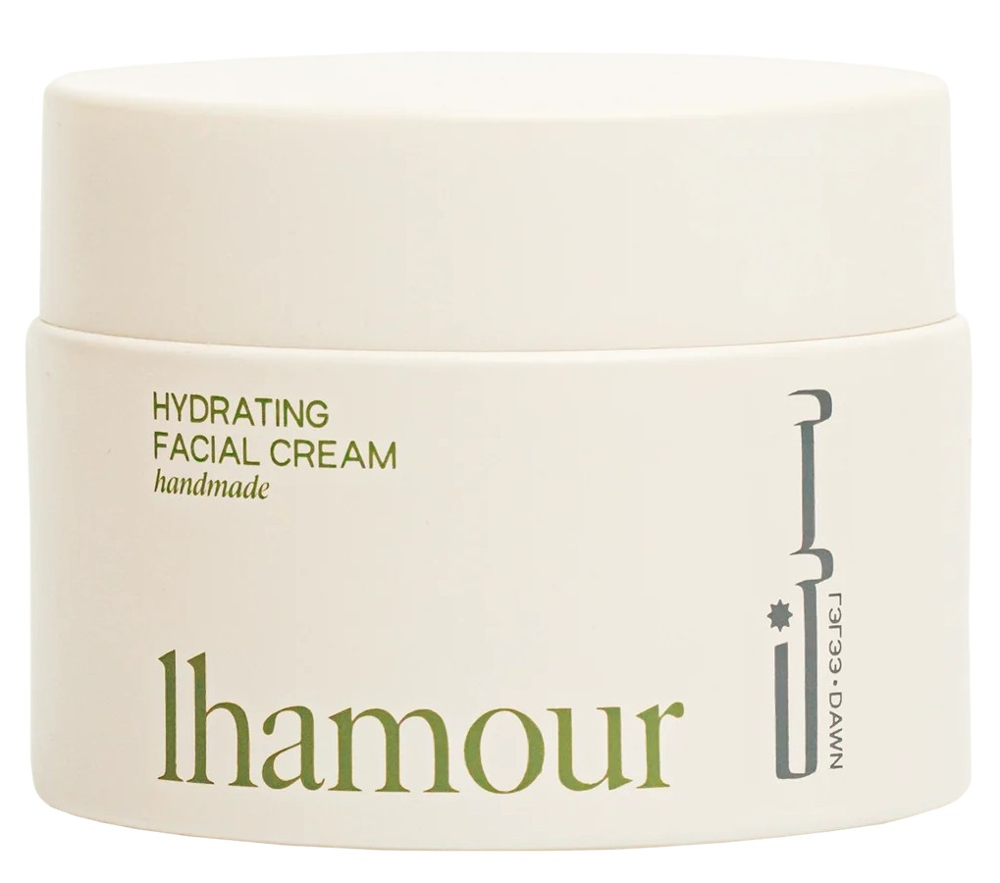

Blackheads. Ugh! Those pesky little dots that seem impossible to get rid of. But don’t worry, I’ve got you covered! In this blog, I’ll share two tried-and-true methods to tackle blackheads – a DIY trick that’s super simple and a product-based routine for those who love a bit of skincare pampering. Let’s dive in!

# Method 1: DIY Blackhead Removal Hack

## What You’ll Need:

- Bentonite clay
- Raw honey
- A few drops of tea tree oil (optional)
- A small bowl and spoon

*Disclaimer: Some of the links in this post are affiliate links. If you make a purchase through these links, I may earn a small commission at no extra cost to you. Your support helps me continue to create content and share valuable resources with you!*   

## Steps:

- **Prep Your Skin:** Tie your hair back and cleanse your face with a gentle cleanser, like Etude House Soon Jung 6.5 Whip Cleanser, to remove dirt and makeup.
- **Mix the Mask:** In a small bowl, combine 1 tsp bentonite clay with 1 tsp honey. Add 1–2 drops of tea tree oil if your skin is acne-prone.
- **Apply the Mask:** Spread a thin layer over blackhead-prone areas (nose, chin, forehead).
- **Let It Sit:** Leave the mask on for 10–15 minutes until partially dry. It will gently pull out impurities without over-drying your skin.
- **Rinse Off:** Wash your face with lukewarm water and pat dry.
- **Moisturize:** Finish with a soothing gel to calm the skin. Korean favorite IsNtree Aloe Soothing Gel works perfectly!

  

    
  

### Precautions:

- Always patch-test ingredients like bentonite clay, honey, or tea tree oil on a small area before applying to your face.  
- Avoid using this mask on broken, irritated, or inflamed skin.  
- Do not leave the mask on for longer than 15 minutes to prevent dryness or irritation.  
- Be gentle when removing blackheads—never force extraction with fingers or pins to avoid scarring or infection.  
- Follow up with a soothing moisturizer or gel, like IsNtree Aloe Soothing Gel, to calm the skin.  
- Limit use to 1–2 times per week; overuse can compromise your skin barrier.  

---

# Method 2: Product-Based Blackhead Removal Routine

If DIY isn’t your thing, no worries! Here’s a simple product-based routine to keep your blackheads in check.

## Step 1: Start with Cleansing Oil

Cleansing oils are amazing for melting away dirt and sebum that clog your pores. Massage a cleansing oil, onto your nose and rinse thoroughly. Never ever forget to emulsify the oil for at least 1 minute before washing it off. If cleansing oil isn't your thing (like me) then you can try cleansing balm too.

## My Pick:

- Banila Co Clean It Zero Cleansing Balm
- Dr.Althea Pure Grinding Cleansing Balm
- Lanbelle Deep Cleansing Oil (Dry or sensitive skin)
- Anua Heartleaf Pore Control Cleansing Oil

  

    
  

  

    
  

   

    
  

  

    
  

## Step 2: Double Cleanse

Follow up with a gentle foam cleanser to remove any leftover residue.

## My Pick:

- ANUA Heartleaf Quercetinol Pore Deep Cleansing Foam
- ETUDE SoonJung pH 6.5 Whip Facial Cleanser

  

    
  

   

    
  

## Step 3: Apply a Pore Mud Pack

This is where the magic happens! Apply a generous layer of a pore clay mask, like the Innisfree Super Volcanic Pore Clay Mask, to your dry nose. Let it work its wonders for 10-15 minutes before washing it off with lukewarm water. The clay helps to draw out impurities and tighten pores.

## My Pick:

- Innisfree Super Volcanic Pore Clay Mask
- Beauty of Joseon Red Bean Pore Refreshing Mask Mud Cream

  

    
  

  

    
  

## Step 4: Soothe with Toner Pads

After cleansing, use toner pads to calm and hydrate your skin. NEOGEN Dermalogy Real Cica Pad or BRING GREEN Tea Tree CICA Soothing Toner PAD is a fantastic option to soothe post-mask skin. If you're looking for the perfect toner pads to take your skincare game to the next level, you check out [*Top 5 Korean Toner Pads to Transform Your Skincare Routine.*](https://petallifestyle.pages.dev/posts/the-best-korean-sunscreens-based-on-skin-type/)

  

    
  

  

    
  

## Frequency:

Do this routine once a week to avoid over-exfoliation and keep your skin balanced.

---

## Additional Tips to Keep Blackheads at Bay

- **Exfoliate Weekly:** Use a mild exfoliator to remove dead skin cells and prevent pore clogging.
- **Stay Hydrated:** Hydration is key to healthy skin! Don’t skip your moisturizer, even if you have oily skin. Etude House SoonJung Hydro Barrier Cream is lightweight and perfect for all skin types. If you are into sustainable skincare then you can definitely go for [*Lhamour Natural Hydrating Facial Cream*](https://www.lhamour.com/products/natural-hydrating-facial-cream?sca_ref=8121337.DCmZafggw7) which is known to be an organic skincare brand without hidden toxins, uses pure, antioxidant-rich ingredients. It is super light weight and gets absorbed easily. (It also has FREE gift available for each order).

***Disclaimer: Some of the links or references on this page may contain images of women. We kindly advise our brothers in faith to avoid clicking on them, so that their nazar may remain in ḥifāẓat (protection). By placing this note, we intend to keep ourselves free from any blame. If one still chooses to proceed, the responsibility lies with them alone.***

  
  

    <a href="https://www.lhamour.com/products/natural-hydrating-facial-cream?sca_ref=8121337.DCmZafggw7">
      🔗 Lhamour Natural Hydrating Facial Cream
    </a>
  

- **Avoid Touching Your Face:** Constantly touching your face can transfer bacteria and oils, making blackheads worse.
- **Use Sunscreen Daily:** Protect your skin from sun damage and prevent pores from enlarging. You can go for Beauty of Joseon Daily Relief Sunscreen. If you want to find out the perfect sunscreen based on your skin type check out **[*The Best Korean Sunscreens Based On Skin Type .*](https://petallifestyle.pages.dev/posts/the-best-korean-sunscreens-based-on-skin-type/)**

  

    
  

  

    
  

---

Blackheads may be stubborn, but with these methods and consistent care, you can keep them under control. Whether you prefer a quick DIY or a relaxing skincare routine, there’s an option for everyone. So go ahead, give these tips a try, and flaunt that smooth, radiant skin! 

Do you have a favorite blackhead removal hack or product? Let me know in the comments below!