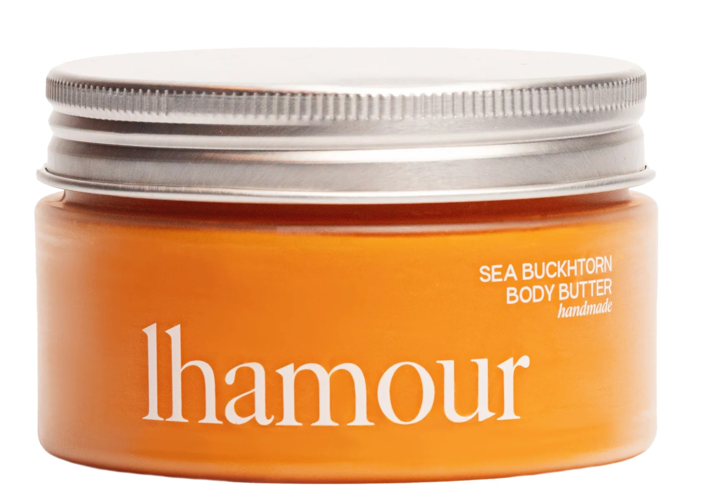
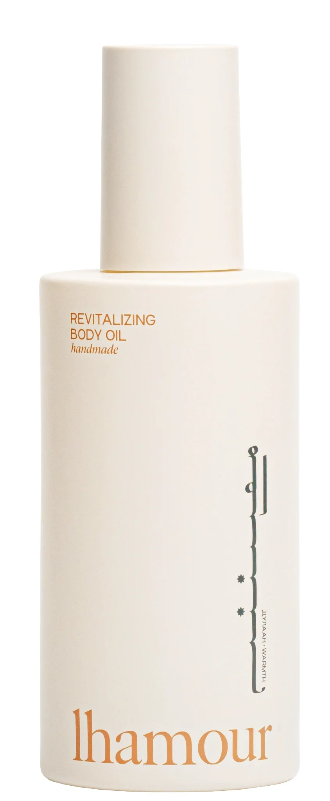

Winter can be harsh on your skin, but keeping it soft and nourished doesn’t have to cost a fortune. Here’s a simple checklist to tackle dry, flaky skin from head to toe without stretching your budget.

# **1. Hydrate Inside and Out**

**• Drink Water:** Staying hydrated is key. Carry a water bottle wherever you go.

**• Use a Humidifier:** Add moisture to the air in your home to prevent skin from drying out.

<iframe title="Humidifier" src="https://shopmy.us/collections/embed/2888034?" style="width: 100%; min-height: 340px; border: none;"></iframe>

*Disclaimer: Some of the links in this post are affiliate links. If you make a purchase through these links, I may earn a small commission at no extra cost to you. Your support helps me continue to create content and share valuable resources with you!*   

# **2. Gentle Cleansing is Essential**

**• Face and Body:** Swap harsh soaps for gentle, hydrating cleansers. Look for options with ceramides or oatmeal, like Round Lab 1025 Dokdo Cleanser or Etude House Soon Jung 6.5 Whip Cleanser.

**• Feet:** Use a mild foot wash to avoid stripping natural oils.

  

    
  

<iframe title="Body Wash" src="https://shopmy.us/collections/embed/3257125?" style="width: 100%; min-height: 340px; border: none;"></iframe>

***Disclaimer: Some of the links or references on this page may contain images of women. We kindly advise our brothers in faith to avoid clicking on them, so that their nazar may remain in ḥifāẓat (protection). By placing this note, we intend to keep ourselves free from any blame. If one still chooses to proceed, the responsibility lies with them alone.***

# **3. Moisturize Right After Bathing**

**• Face:** Opt for a fragrance-free cream with hyaluronic acid or glycerin, such as Illiyoon Ceramide Ato Lotion or [**Lhamour Award-Winning Natural Facial Oil For Deep Hydration & Healthy Glow**](https://www.lhamour.com/products/natural-rosehip-facial-oil?sca_ref=8121337.DCmZafggw7).

**• Body:** Choose rich body lotions or creams with shea butter or coconut oil. For a sustainable, vegan option, try [**Lhamour Natural Sea Buckthorn Oil Body Butter**](https://www.lhamour.com/products/natural-sea-buckthorn-oil-body-butter?sca_ref=8121337.DCmZafggw7)or [**Natural Revitalizing Body Oil**](https://www.lhamour.com/products/natural-revitalizing-body-oil?sca_ref=8121337.DCmZafggw7) — handmade by women and crafted with zero-waste practices, these products lock in moisture while keeping your skin soft, balanced, and radiant. [Bonus bonus: It offers FREE gift available for each order.]

**• Hands:** For targeted hand care, use [**Lhamour Natural Sea Buckthorn Hand Butter**](https://www.lhamour.com/products/natural-sea-buckthorn-hand-butter?sca_ref=8121337.DCmZafggw7), which nourishes dry hands without synthetic additives.

**• Feet:** Apply a thick foot cream like [**Lhamour Natural Sea Buckthorn Oil Foot Salve**](https://www.lhamour.com/products/natural-sea-buckthorn-oil-foot-salve?sca_ref=8121337.DCmZafggw7) or O’Keeffe’s Healthy Feet, and wear socks overnight for deep hydration.

  
  

      
      
<a href="https://www.lhamour.com/products/natural-sea-buckthorn-oil-body-butter?sca_ref=8121337.DCmZafggw7">
        🔗 Lhamour Natural Sea Buckthorn Oil Body Butter</a>

  

  

      
      
<a href="https://www.lhamour.com/products/natural-sea-buckthorn-oil-foot-salve?sca_ref=8121337.DCmZafggw7">
        🔗 Lhamour Natural Sea Buckthorn Oil Foot Salve</a>

  

    

      
      
<a href="https://www.lhamour.com/products/natural-rosehip-facial-oil?sca_ref=8121337.DCmZafggw7">
        🔗Lhamour Award-Winning Natural Facial Oil </a>

  

    

      
      
<a href="https://www.lhamour.com/products/natural-sea-buckthorn-hand-butter?sca_ref=8121337.DCmZafggw7">
        🔗 Lhamour Natural Sea Buckthorn Hand Butter</a>

    

  

        
         

        <a href="https://www.lhamour.com/products/natural-revitalizing-body-oil?sca_ref=8121337.DCmZafggw7">
          🔗 Lhamour Revitalizing Body Oil
        </a>
      

      

# **4. Exfoliate, But Don’t Overdo It**

**• Face:** Use a gentle exfoliant 1-2 times a week to remove dead skin cells, such as [Beauty of Joseon Apricot Blossom Peeling Gel](https://go.shopmy.us/p-36749563).

**• Body:** Try a [***DIY sugar scrub***](https://petallifestyle.pages.dev/posts/diy-body-scrub-recipes-transform-your-skin-using-kitchen-ingredients/)or use [Tree Hut Shea Sugar Scrub](https://go.shopmy.us/p-36749734)for your elbows, knees, and hands.

**• Feet:** Use a pumice stone in the shower to keep heels smooth.

  

    
  

  

    
  

# **5. Shield Your Skin from the Elements**

**• Lips:** Keep a lip balm all the times to prevent chapping. Try using [**Lhamour Natural Coconut Oil Lip Balm**](https://www.lhamour.com/products/natural-coconut-oil-lip-balm?sca_ref=8121337.DCmZafggw7)or [**Natural Beeswax lip balm**](https://www.lhamour.com/products/natural-beeswax-lip-balm?sca_ref=8121337.DCmZafggw7).

**• Face and Body:** Don’t skip sunscreen. Winter sun can still cause damage. Choose those that are moisturizing like [Beauty of Joseon Daily Relief Sunscreen](https://go.shopmy.us/p-36742214)or [IUNIK Centella Calming Moisture Daily Sunscreen](https://go.shopmy.us/p-36742167).

<iframe title="Sunscreen" src="https://shopmy.us/collections/embed/3370372?" style="width: 100%; min-height: 340px; border: none;"></iframe>

**• Hands:** Wear gloves to protect your hands from cold, dry air.

    

      
      
<a href="https://www.lhamour.com/products/natural-coconut-oil-lip-balm?sca_ref=8121337.DCmZafggw7">
        🔗 Lhamour Natural Coconut Oil Lip Balm </a>

    

    

      
      
<a href="https://www.lhamour.com/products/natural-beeswax-lip-balm?sca_ref=8121337.DCmZafggw7">
        🔗 Lhamour Natural Beeswax lip balm</a>

    

# **6. Budget-Friendly Products to Try**

**• Face:** Etude House Soon Jung 6.5 Whip Cleanser.

**• Body:** eos Shea Better Body Lotion.

**• Feet:** Kose Q10 Night Renewal Cream

<iframe title="Lotion" src="https://shopmy.us/collections/embed/3274176?" style="width: 100%; min-height: 340px; border: none;"></iframe>

# **7. DIY Winter Skin Remedies**

**• Face Mask:** Mix yogurt, honey, and oatmeal for an instant hydration boost.

**• [*Body Scrub:*](https://petallifestyle.pages.dev/posts/diy-body-scrub-recipes-transform-your-skin-using-kitchen-ingredients/)** Combine coconut oil and sugar for a nourishing exfoliant.

**• Foot Soak:** Use warm water with Epsom salts and a few drops of lavender oil.

# **8. Stay Warm Without Overheating**

Hot showers feel great but can dry out your skin. Stick to lukewarm water and limit your shower time to 10-15 minutes8. Stay Warm Without Overheating.

# **9. Layer Up with Lightweight Fabrics**

Choose breathable layers to prevent skin irritation. Cotton or silk underlayers work wonders.
****

With these tips, you can enjoy healthy, glowing skin all winter long without spending a fortune. Your skin will thank you for the extra care! 💖