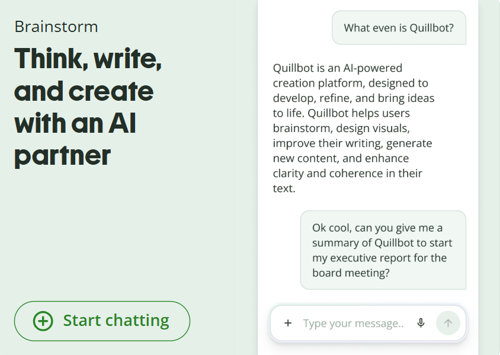
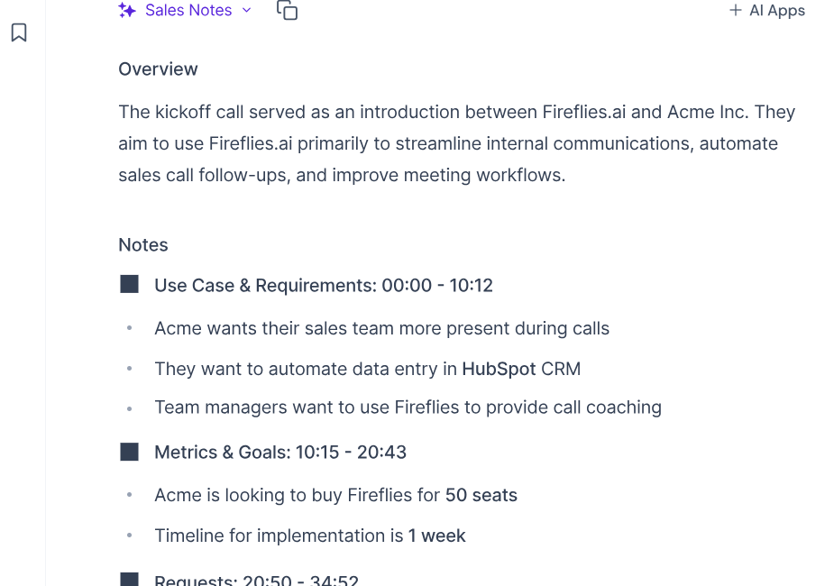
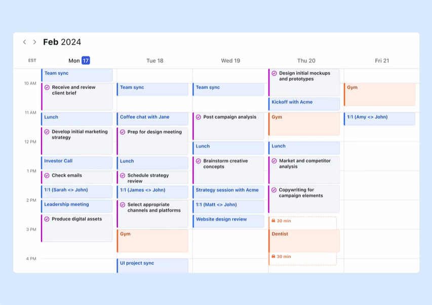

Last reviewed: June 2026

The average knowledge worker loses hours every week to the same three things: writing emails, sitting through meetings, and figuring out what to actually work on next.

These 10 AI tools handle exactly those problems -- quietly, without the LinkedIn hype. No ChatGPT. No Notion. Just the tools that are actually doing the work while everyone else is still talking about doing the work.

This list is for the students pulling all-nighters, the remote workers on their 6th Zoom call of the day, and the content creators who just want to stop drowning in tabs.

Let's get into it.

---

> **Disclosure:** Some links in this post are affiliate links. If you purchase through them, I may earn a small commission at no extra cost to you. It helps keep this blog going!

> **Faith note:** Some external product pages may contain images of women. Brothers in faith, please proceed with caution. Responsibility lies with the individual.

---

## Quick Comparison: Which Tool Is Right for You?

Not sure where to start? Here's the cheat sheet:

| Tool | Best For | Free Plan? | Paid Starts At |
|------|----------|------------|----------------|
| [Ellie](https://tryellie.com/) | Writing email replies | Limited | ~$19/mo |
| [Screenpipe](https://screenpipe.com/) | Searching your entire screen history | Yes (free & open source) | ~$21/mo (Basic) |
| [Otter.ai](https://otter.ai/) | Transcribing lectures and meetings | Yes (300 min/mo) | ~$17/mo |
| [QuillBot](https://quillbot.com/) | Rewriting and polishing text | Yes | ~$10/mo |
| [Fireflies.ai](https://fireflies.ai/?fpr=sadia74) | Full meeting recording + summaries | Yes (limited) | ~$10/mo |
| [Motion](https://www.usemotion.com/) | AI-powered daily scheduling | No | ~$19/mo |
| [Copy.ai](https://www.copy.ai/use-cases/content-creation) | Blog posts and marketing copy | No | ~$29/mo |
| [Superhuman](https://superhuman.com/) | Speed-optimized email management | Yes | $12/mo |
| [Krisp.ai](https://krisp.ai/individuals-freelancers/) | Removing background noise on calls | Yes (7 day trial) | ~$8/mo |
| [Lumen5](https://lumen5.com/) | Turning blog posts into videos | Yes (watermarked) | ~$19/mo |

Jump to any tool below, or read straight through -- your call.

---

## 1. [Ellie - The AI Email Assistant That Actually Sounds Like You](https://tryellie.com/)

**Best for:** Anyone who types "Sorry for the late reply!" more than 3 times a week.

Email is a productivity black hole. You spend 40 minutes writing professional responses and somehow still sound awkward. Ellie is a Chrome extension that reads a few of your past emails, learns your writing style, and writes replies *for* you.

Not robotic, not formal-to-the-point-of-painful. It sounds like *you* -- but faster.

**Pros:**
- Learns your actual tone from real examples (not a generic template)
- Works directly in Gmail via Chrome extension
- Serious time-saver for high-volume inboxes

**Cons:**
- Works best in Gmail; limited outside it
- Takes a few emails to "learn" your style -- not instant
- Free plan is limited; paid starts around $19/month

**Who should try it:** Students replying to professors, freelancers managing clients, anyone who says "I'll reply later" and then... doesn't.

💡 *Pair Ellie with the [best Chrome extensions for students](https://petallifestyle.pages.dev/posts/best-chrome-extensions-for-students-supercharge-your-study--it-skills/) for a browser setup that actually gets things done.*

<figure style="text-align: center;">
  
  <figcaption>Ellie learns your email style and writes replies for you. Source: tryellie.com</figcaption>
</figure>

---

## 2. [Screenpipe - A Search Engine for Your Entire Screen History](https://screenpipe.com/)

**Best for:** People who say "wait, what did they say in that meeting?" at least once a day.

Screenpipe records everything on your screen -- meetings, calls, browsing, documents -- and makes it searchable with natural language. Forgot something from three weeks ago? Just type a keyword or ask the AI and it finds the exact moment.

Everything is stored locally on your device, not in the cloud. That's a significant privacy win -- and unlike its predecessor (Rewind AI, which was acquired by Meta in late 2025 and shut down), Screenpipe is fully open source and actively maintained.

**Pros:**
- Fully local and offline (your data never leaves your computer)
- Open source -- every line of code is auditable
- Works on Mac, Windows, and Linux (Rewind was Mac-only)
- Eliminates frantic note-taking during calls
- Free core version; no subscription required to start

**Cons:**
- Free version requires building from source -- not plug-and-play for non-developers
- Basic plan ($21/mo) is steep for casual users
- "Recording everything" takes some getting used to -- fair reaction

**Who should try it:** Remote workers, consultants, PhD students, researchers, anyone whose job involves remembering a lot.

<figure style="text-align: center;">
  
  <figcaption>Screenpipe records your screen locally and makes everything searchable with AI. Source: screenpipe.com</figcaption>
</figure>

---

## 3. [Otter.ai - Real-Time AI Transcription for Lectures and Meetings](https://otter.ai/)

**Best for:** Students, journalists, anyone who can't type as fast as people talk.

Otter.ai transcribes meetings, lectures, and interviews in real time with impressive accuracy. It identifies different speakers, highlights key moments, and syncs with Zoom and Google Meet. Your notes basically write themselves.

**Pros:**
- Speaker identification (knows who said what)
- Real-time captions during live calls
- Free plan is genuinely usable (300 minutes/month)
- Integrates with Zoom, Teams, Google Meet

**Cons:**
- Struggles with heavy accents or very fast speakers
- Free plan has a 30-minute limit per conversation
- AI summaries can miss nuance in complex discussions

**Who should try it:** University students recording lectures, content creators doing interviews, anyone who hates manual transcription (so... everyone).

<figure style="text-align: center;">
  
  <figcaption>Otter.ai transcribes your meetings so you can actually pay attention in them. Source: Internet</figcaption>
</figure>

---

## 4. [QuillBot - AI Writing Assistant for Students and Non-Native Speakers](https://quillbot.com/)

**Best for:** Students, writers, non-native English speakers, anyone who stares at a sentence thinking "this sounds wrong but I can't explain why."

QuillBot is often dismissed as "just a paraphrasing tool." But it has evolved into a full AI writing assistant -- it rewrites, summarizes, checks grammar, and includes a plagiarism checker. The paraphraser has multiple modes  (fluency, formal, creative) to fit different writing contexts. I often use QuillBot to smooth out awkward sentences for my report writing.

**Pros:**
- Multiple rewriting modes for different tones
- Summarizer is genuinely useful for research
- Free plan covers most basic needs
- Solid plagiarism checker (paid tier)

**Cons:**
- Can oversimplify complex arguments
- Free version has a word limit per session
- Use it to *polish* your writing, not replace it

**Who should try it:** Students writing assignments, bloggers fighting writer's block, professionals drafting formal emails.

<figure style="text-align: center;">
  
  <figcaption>QuillBot - AI Writing Assistant for Students and Non-Native Speakers. Source: quillbot.com</figcaption>
</figure>

💡 *Combine QuillBot with a [solid morning routine](https://petallifestyle.pages.dev/posts/creating-the-perfect-morning-routine-for-a-productive-day/) and your writing output will genuinely double.*

---

## 5. [Fireflies.ai - The AI Meeting Assistant That Writes Your Notes For You](https://fireflies.ai/?fpr=sadia74)

**Best for:** Team leads, freelancers, anyone who leaves meetings thinking "wait, what were the action items again?"

Fireflies.ai joins your Zoom, Teams, or Google Meet call automatically, records everything, transcribes it, and delivers a searchable summary with action items already highlighted. It is not just transcription -- it understands the meeting.

**What makes it worth it:**
- Auto-joins calls so you never have to set anything up mid-day
- Smart summaries with action item detection (not just a wall of text)
- Searchable archive across ALL your past meeting transcripts
- Integrates with Slack, Notion, HubSpot, and more
- Free plan to get started -- no credit card required

**Cons:**
- Some teams find a bot joining calls a bit jarring at first (just give them a heads-up)
- AI summaries occasionally miss highly context-specific points
- Free plan has storage limits

**Who should try it:** Freelancers managing client calls, startup teams, students drowning in group project meetings -- basically anyone who sits through more than 3 meetings a week.

If meetings are a major part of your week, Fireflies is probably the easiest tool on this list to see immediate value from.

**[Try Fireflies.ai free - no credit card needed](https://fireflies.ai/?fpr=sadia74)**

<figure style="text-align: center;">
  
  <figcaption>Fireflies.ai handles your meeting notes so your brain doesn't have to. Source: fireflies.ai</figcaption>
</figure>

---

## 6. [Motion - The AI Scheduler That Plans Your Day Automatically](https://www.usemotion.com/)

**Best for:** Chronically overwhelmed people with 47 browser tabs and a to-do list that gives them anxiety.

Motion is probably the most underrated tool on this entire list. It is an AI-powered calendar and task manager that automatically schedules your tasks around your meetings, deadlines, and work hours. You add tasks, set priorities, and Motion figures out *when* you will do them -- without you lifting another finger.

If something runs over or you add an urgent task, it reschedules everything automatically.

**Pros:**
- Genuinely intelligent scheduling (not just a pretty calendar)
- Blocks focus time automatically
- Prevents the "I'll do it later" spiral
- Great for people who underestimate how long tasks take (everyone)

**Cons:**
- Steep learning curve in the first week
- You still have to input your tasks (not psychic)

**Who should try it:** Freelancers, remote workers, students with multiple deadlines, anyone who has ever missed something because they forgot to check their planner.

💡 *If you like structured days, this guide on [weekly planning in 10 minutes](https://petallifestyle.pages.dev/posts/weekly-planning-in-10-minutes-yes-its-possible/) pairs well with Motion.*

<figure style="text-align: center;">
  
  <figcaption>Motion - The AI Scheduler That Plans Your Day Automatically. Source: usermotion.ai</figcaption>
</figure>

---

## 7. [Copy.ai - AI Content Creation for Bloggers and Marketers](https://www.copy.ai/use-cases/content-creation)

**Best for:** Bloggers, marketers, small business owners who need content regularly and don't have 3 hours to stare at a blank page.

Copy.ai generates blog posts, product descriptions, social media captions, ad copy, and more. The newer versions are significantly better than early AI writing tools -- less repetitive, more context-aware.

**Pros:**
- Covers nearly every content type (ads, emails, posts, SEO descriptions)
- Workflow builder for longer content pieces
- Good free tier to test before committing
- Faster than starting from scratch every time

**Cons:**
- Still needs human editing -- treat it as a first draft
- Gets repetitive if you use the same prompts
- Requires guidance to match your brand voice

**Who should try it:** Bloggers, Etsy sellers, social media managers, content creators who need volume without burning out.

---

## 8. [Superhuman - Email Management for People Who Live in Their Inbox](https://superhuman.com/)

**Best for:** People whose job is essentially "professional emailer."

Superhuman is a premium email client built for speed. AI-powered shortcuts, split inbox, read receipts, follow-up reminders, and a keyboard-driven interface that makes regular Gmail feel like dial-up internet.

**Pros:**
- Blazing fast email via keyboard shortcuts for everything
- AI writes email summaries and suggested replies
- Split inbox keeps newsletters, team emails, and clients separate
- Read status tracking built in

**Cons:**
- Major overkill if you get under 30 emails a day

**Who should try it:** Founders, consultants, freelancers managing 5+ clients -- anyone for whom email is a core part of the job.

<figure style="text-align: center;">
  
  <figcaption>Superhuman is email for people who live in their inbox. Source: Internet</figcaption>
</figure>

---

## 9. [Krisp.ai - AI Noise Cancellation for Remote Workers and Students](https://krisp.ai/individuals-freelancers/)

**Best for:** Remote workers, online students, anyone whose cat/sibling/entire neighborhood has terrible meeting timing.

Krisp uses AI to remove background noise from your calls in real time. Dog barking? Gone. Construction outside? Gone. Your roommate apparently deciding to learn the drums? Also gone.

It works as a virtual microphone layer -- install it, select "Krisp Microphone" in Zoom, Teams, or whatever app you use, and you instantly sound like you're in a recording studio.

**Pros:**
- Works with every call app (Zoom, Teams, Discord, Google Meet, and more)
- Removes noise AND echo
- Free plan gives 60 minutes per day -- decent for light use
- Works on both mic and speaker sides

**Cons:**
- Heavy noise suppression can make your voice sound slightly processed
- 60 min/day free limit runs out fast in back-to-back meetings
- Computer-based calls only -- does not work on phone calls

**Who should try it:** Remote workers, online students, freelancers doing client calls, content creators recording voiceovers.

---

## 10. [Lumen5 - Turn Blog Posts Into Videos Automatically](https://lumen5.com/)

**Best for:** Content creators, bloggers, and marketers who want video content without learning video editing.

Lumen5 takes your blog post URL (or pasted text) and automatically turns it into a short video -- pulling key sentences, pairing them with stock visuals, and generating a ready-to-post clip. No editing skills required.

Not a replacement for professional video editing. But for repurposing content quickly? Genuinely impressive.

**Pros:**
- Paste text, get a video -- it's really that simple
- Good built-in stock media library
- Brand kit feature for consistent visual style
- Great for LinkedIn, Facebook, YouTube Shorts

**Cons:**
- Free plan adds a watermark
- AI scene selection is hit-or-miss; you'll want to tweak manually
- Not ideal for highly technical content

**Who should try it:** Bloggers repurposing posts, small business owners doing social media, marketing teams with tight budgets.

<figure style="text-align: center;">
  
  <figcaption>Lumen5 converts your writing into video automatically. Source: lumen5.com</figcaption>
</figure>

---

## Which AI Productivity Tool Should You Choose?

If you're overwhelmed by 10 options, here's the shortcut:

| If you need... | Use this |
|----------------|----------|
| Meeting notes without lifting a finger | [Fireflies.ai](https://fireflies.ai/?fpr=sadia74) |
| Lecture or interview transcription | Otter.ai |
| Intelligent daily scheduling | Motion |
| Writing help for essays or emails | QuillBot |
| AI email replies that sound like you | Ellie |
| Background noise removal on calls | Krisp.ai |
| Turning blog posts into videos | Lumen5 |
| Speed-first email management | Superhuman |
| Blog and marketing copy | Copy.ai |
| Searching your screen history | [Screenpipe](https://screenpipe.com/) |

**My personal top 3 picks:**

- **[Fireflies.ai](https://fireflies.ai/?fpr=sadia74)** - the best time-to-value ratio of any tool here. Free to start, immediately useful.
- **Otter.ai** - genuinely life-changing if you are a student or do regular interviews.
- **Motion** - if scheduling chaos is your biggest pain point and you can justify the price, nothing else comes close.

## Best AI Productivity Tools by Use Case

### Best for Students
1. Otter
2. [QuillBot](https://quillbot.com/)
3. [Motion](https://www.usemotion.com/)

### Best for Remote Workers
1. [Fireflies](https://fireflies.ai/?fpr=sadia74)
2. [Krisp](https://krisp.ai/individuals-freelancers)
3. [Motion](https://www.usemotion.com/)

### Best for Content Creators
1. [Copy.ai](https://www.copy.ai/use-cases/content-creation)
2. [Lumen5](https://lumen5.com)
3. [QuillBot](https://quillbot.com/)

---

## Honorable Mentions Worth Knowing

A few tools that didn't make the top 10 but are genuinely useful in 2026:

- **Perplexity AI** - A search engine powered by AI that cites its sources. Far better than Googling something and landing on 15 SEO-spam sites.
- **Notion AI** - If you already use Notion, the built-in AI is surprisingly good for summarizing pages, drafting content, and auto-filling databases.
- **Grammarly** - Not underrated exactly, but still massively underused. The tone detector and clarity suggestions go beyond basic spellcheck.
- **Reclaim.ai** - Like Motion but more focused on protecting focus time. Great free tier and worth trying before paying for Motion.

---

## What About Your Physical Setup?

The best AI tools cannot fix a bad workspace. If your desk is chaos, your brain will be too.

Check out the [10 must-have cute desk gadgets for productivity](https://petallifestyle.pages.dev/posts/10-must-have-cute-desk-gadgets-for-productivity-and-aesthetics/) -- because your setup should work as hard as your tools do.

And when your brain genuinely needs a reset (not a "check Instagram" break -- an actual reset), these [weirdly addictive websites](https://petallifestyle.pages.dev/posts/weirdly-addictive-websites-youll-keep-revisiting-that-youve-never-heard-of/) are the kind of detour that actually refreshes you. Or try this roundup of [virtual escapes for instant relaxation](https://petallifestyle.pages.dev/posts/virtual-escaping-10-fun-websites-for-instant-relaxation-and-exploration/).

Don't underestimate a proper break between work sessions either. This post on [essential self-care products for study breaks](https://petallifestyle.pages.dev/posts/essential-self-care-products-for-study-breaks-refresh-recharge-and-re-focus/) will have you actually looking forward to stepping away.

---

## Shop the Productivity Setup

Curated picks from my ShopMy storefront that pair well with the tools above:

**Keyboards** (for those long transcription and writing sessions):
<iframe title="Keyboards" src="https://shopmy.us/collections/embed/2750031?" style="width: 100%; min-height: 340px; border: none;"></iframe>

**Desk setup essentials** (because aesthetic and functional can coexist):
<iframe title="Desk" src="https://shopmy.us/collections/embed/2841485?" style="width: 100%; min-height: 340px; border: none;"></iframe>

**Earphones** (for Krisp users who also want to enjoy audio):
<iframe title="Earphones & Cases" src="https://shopmy.us/collections/embed/2888568?" style="width: 100%; min-height: 340px; border: none;"></iframe>

---

## The Bottom Line

These tools are not about replacing your brain. They are about stopping the time leaks -- the email spirals, the missed meeting notes, the scheduling chaos, the staring-at-a-blank-document moments.

Even using 2-3 consistently could give you hours back every week.

You do not need every tool. You need the *right* ones for how you work.

**Start here if you are not sure:** [Fireflies.ai is free to try](https://fireflies.ai/?fpr=sadia74) and the easiest one to set up -- most people see the value within the first meeting.

Which one are you trying first? Drop it in the comments -- genuinely curious. And if this was useful, share it with a friend who is still handwriting every meeting note in 2026. They need this more than they know.

---

## Save This for Later

Not ready to try everything right now? Pin this post or bookmark it -- you'll want to come back when you're ready to actually upgrade your workflow.

---

## Frequently Asked Questions

### What are the best underrated AI productivity tools in 2026?
Tools like Fireflies.ai (meeting notes), Motion (AI scheduling), Krisp (noise cancellation), and Otter.ai (transcription) are all highly underrated. They solve specific, annoying problems really well -- and most people have no idea they exist.

### Are these AI productivity tools free?
Most offer free plans with usable features. Otter.ai, QuillBot, Krisp, Fireflies.ai, and Copy.ai all have free tiers worth trying. Motion and Superhuman are paid-only but worth it for heavy users.

### Which AI tools are best for students?
**Otter.ai** for transcribing lectures, **QuillBot** for writing assistance, **Motion** or **Reclaim.ai** for managing deadlines, and **Ellie** for handling emails professionally. All have free or affordable tiers for students.

### Can AI tools actually save you time, or is it hype?
When matched to the right problem, yes -- genuinely. Fireflies.ai alone can save 30-60 minutes per meeting. Otter.ai removes manual note-taking entirely. Motion removes daily planning. The key is using them consistently, not just signing up and forgetting.

### What's the best AI tool for content creation?
**Copy.ai** and **Lumen5** are both strong. Copy.ai handles written content across formats. Lumen5 converts text into video. Use them together for a repurposing workflow that actually scales.

### Do I need all these tools?
Absolutely not. Pick 1-2 that solve your actual biggest time sink and master those first. Adding 10 new tools without using any of them consistently is its own productivity problem.

---

*Found this helpful? You might also love:*
- [Best Chrome Extensions for Students](https://petallifestyle.pages.dev/posts/best-chrome-extensions-for-students-supercharge-your-study--it-skills/)
- [Weekly Planning in 10 Minutes](https://petallifestyle.pages.dev/posts/weekly-planning-in-10-minutes-yes-its-possible/)
- [10 Cute Desk Gadgets for Productivity](https://petallifestyle.pages.dev/posts/10-must-have-cute-desk-gadgets-for-productivity-and-aesthetics/)
- [Adorable Gadgets for Stress Relief During Study Breaks](https://petallifestyle.pages.dev/posts/adorable-gadgets-for-stress-relief-during-study-breaks/)
- [Morning Routine for a Productive Day](https://petallifestyle.pages.dev/posts/creating-the-perfect-morning-routine-for-a-productive-day/)