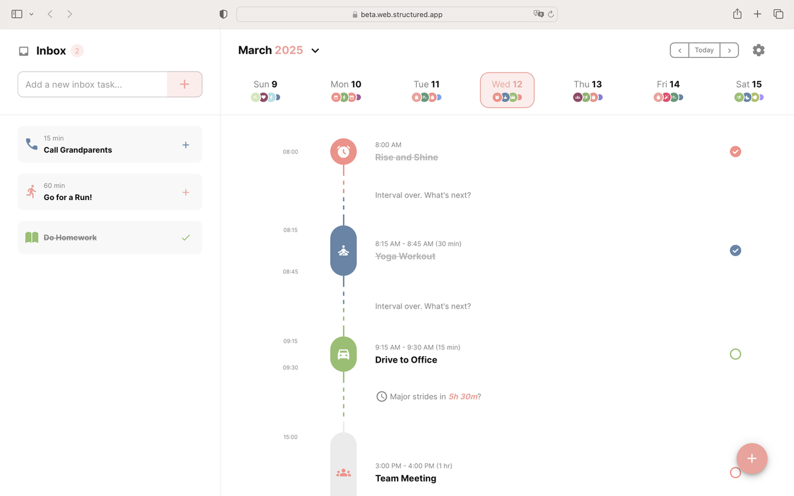
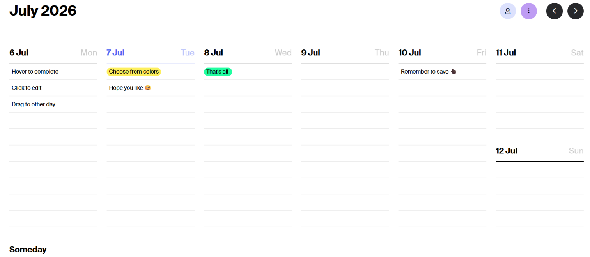

<!--
SEO ASSETS (internal reference, not for publishing)

SEO Title Options:
1. 10+ Best Weekly Planning Apps in 2026 (Notion, TickTick, Sunsama & More Tested)
2. Best Weekly Planner Apps 2026: Honest Reviews + Physical Planner Picks
3. Weekly Planning Apps That Actually Work in 2026 (Tested & Compared)

Meta Description: Honest 2026 breakdown of the best weekly planning apps and physical planners: real pros, cons, and prices for Notion, TickTick, Sunsama, Structured, Tweek, and more.

URL Slug: weekly-planning-apps-2026-digital-physical-planner-guide

Primary Keyword: best weekly planning apps 2026
Secondary Keywords: best planner app 2026, weekly planner app, digital planner vs physical planner, how to plan your week, best app for time blocking, TickTick review, Sunsama review, Structured app review
Long-Tail Keywords: best weekly planning app for students, Notion vs Tweek for weekly planning, best physical planner 2026, how to plan your week in 10 minutes, digital planner apps for ADHD, best Notion templates for students, TickTick vs Sunsama for productivity

Semantic/related entities: time blocking, task management, habit tracking, Pomodoro technique, academic planner, digital planner, Notion template, weekly spread

People Also Ask targets covered in FAQ: best free planner app, planner app vs task manager, physical vs digital planner, ADHD planner app, Sunsama for students, switching planning systems

Pinterest SEO ideas:
- Pin title: "Best Weekly Planning Apps 2026 (Tested + Honest Pros/Cons)"
- Pin description: Planning your week shouldn't eat an hour of your day. Here's what actually works in 2026, from free apps like Notion Calendar and TickTick to guided planners like Sunsama, plus physical planner picks. Save this for your next planning reset.
- Board suggestions: Productivity Tips, Student Life, Notion Templates, Aesthetic Planners
- Vertical pin image idea: comparison table screenshot styled as an aesthetic graphic, or "This app vs that app" split graphic

Image SEO naming convention: descriptive lowercase-hyphenated filenames matching alt text where a real product photo isn't available yet (dummy filename convention), e.g. "sugar-paper-2026-signature-spiral-planner.png". Real product screenshots use their actual source URLs. Alt text lives inside each img tag, not listed separately.

Internal Linking Opportunities (from content inventory, real URLs only):
- Essentials for an Aesthetic Home Office
- Kawaii Home Office Decor Ideas (Muslim-Friendly)
Suggested future article ideas to build topical authority: "Notion Setup for Muslim Students (Prayer Times + Study Schedule Template)", "How I Track Habits Without Burning Out", "Digital vs Paper Journal: Which Should You Choose".

FINAL REVIEW CHECKLIST (internal, do not publish)
- Readability: short paragraphs, conversational, no em dashes ✓
- SEO coverage: primary + secondary + long-tail keywords woven naturally ✓
- Keyword placement: title, intro, H2s, FAQ ✓
- Factual accuracy: pricing/features re-checked, Structured Android + pricing corrected per official docs, hedged where prices vary by region ✓
- Trustworthiness: honest cons for every product, boycott transparency included ✓
- Conversion: affiliate links + coupons woven near picks, not stacked at the end ✓
- Genuinely helpful: covers digital AND physical, real personal usage note included for TickTick ✓
-->

✨ *Some links in this post are affiliate links. If you purchase through them, I may earn a small commission at no extra cost to you. It helps keep this blog going!*

🌿 *Some external product pages may contain images of women. Brothers in faith, please proceed with caution. Responsibility lies with the individual.*

# 5+ Best Weekly Planning Apps in 2026 (Tested: Notion, TickTick, Sunsama & More)

You open a planning app on Sunday night, promising yourself this is the week you finally get it together. Forty minutes later you're still customizing color tags instead of actually planning anything. Sound familiar?

Most "plan your week in 10 minutes" advice hands you a list of apps and calls it a day. It doesn't tell you which ones actually save time versus which ones just move your procrastination into a prettier interface. That's what this post is for.

## Quick Answer

If you want the short version: **Notion Calendar** is the best free option if your tasks already live in Notion. **TickTick** is the best all-rounder for students and anyone juggling school with work, cheap, cross-platform, and genuinely motivating with its daily stats. **Tweek** is the simplest if you just want to see your week on one clean grid. **Sunsama** is worth the higher price only if you genuinely want a guided daily ritual, not just a task list. And if you're someone who thinks better with a pen in hand, a physical planner will serve you better than any app ever will.

Keep reading for the full breakdown, including what each one actually costs, who should skip it, and how to combine a digital system with a physical planner without overcomplicating your life.

## Do You Even Need an App?

Before you download anything, be honest about how you actually think. Some people process better on a screen. Others need the physical act of writing something down for it to feel real. Neither is wrong, but picking the wrong format is the number one reason planning systems get abandoned by February.

If you already live inside your phone all day for work or school, a digital planner will feel like an extension of that. If screens stress you out or you're trying to reduce your time on them (student life makes this hard, I know), a paper planner removes one more notification source from your day.

You can also do both. A lot of readers use a digital calendar for anything with a fixed time (classes, appointments, meetings) and a paper planner for daily to-dos and reflection. There's no rule that says you have to pick a side.

## Best Weekly Planning Apps in 2026

I researched current reviews and pricing to give you the real pros and cons here, not just marketing copy.

### 1. Notion Calendar (Free)

**Overview:** Notion Calendar (previously called Cron) is a calendar app that syncs directly with your Notion databases. Any database with a date field turns into a calendar event automatically.

**Features:** Two-way sync with Google, Outlook, and now iCloud. Notion database integration. Clean, distraction-free interface.

**Pros:** Completely free. If you already keep your to-do list, class schedule, or content calendar in Notion, this closes the gap between "list of tasks" and "actual schedule" without extra setup.

**Cons:** It's calendar-first, not task-first. If your tasks live outside Notion, you won't get much value here.

**Best for:** Anyone already using Notion who wants their databases to show up as calendar events without paying for anything extra.

**Who should skip it:** People who don't use Notion at all and don't want to learn a new system just for this.

  

    
    
<a href="https://www.notion.com/product/calendar" target="_blank" rel="noopener noreferrer">🔗 Notion Calendar </a>

  

### 2. Notion (Free personal plan, paid plans for teams)

**Overview:** Notion itself deserves its own mention separate from Notion Calendar. It's the "build it yourself" option: blank pages, databases, and templates you can shape into whatever kind of weekly planner works for you.

**Features:** Databases, kanban boards, calendar views, linked pages, an enormous template ecosystem (more on that below).

**Pros:** The free personal plan is genuinely unlimited for individual use. No other tool gives you this much flexibility for free.

**Cons:** That flexibility is also the problem. Notion has a real learning curve, and it's easy to spend hours building the "perfect" planner instead of using it. If you want something that works out of the box, this isn't it, which is exactly why pre-built templates (covered further down) are worth considering.

**Best for:** People who like customizing systems and don't mind some setup time upfront.

**Who should skip it:** If you've tried Notion before and found yourself endlessly tweaking templates instead of planning, a more rigid app will serve you better.

  

    
    
<a href="https://www.notion.com/" target="_blank" rel="noopener noreferrer">🔗 Notion </a>

  

### 3. Structured (Free tier, paid Pro tier)

**Overview:** Structured shows your day as a visual timeline, tasks and events stacked in the order they'll actually happen rather than a flat list.

**Features:** Time-blocked daily, weekly, and monthly views, color coding, and it now runs on Android alongside iOS, macOS, and web.

**Pros:** If you're a visual thinker, seeing your day as a timeline instead of a checklist makes a real difference. The free tier is solid for basic daily planning, and Pro plans start at just a few dollars a month, with yearly and lifetime purchase options too.

**Cons:** The iOS version still gets new features first, and some users report occasional sync delays between devices. If your day is mostly small scattered tasks rather than time-blocked chunks, the timeline format can feel like overkill.

**Best for:** People who want to see their whole day at a glance and think in blocks of time rather than lists.

**Who should skip it:** Anyone who prefers list-based planning over visual timelines.

  

    
    
<a href="https://structured.app/" target="_blank" rel="noopener noreferrer">🔗 Structured </a>

  

### 4. Tweek (Free tier, Premium around $5.99/month)

**Overview:** Tweek shows your entire week as a paper-style grid, one column per day, and lets you drag tasks around without assigning a specific hour. It's the closest digital equivalent to writing on a physical weekly spread.

**Features:** Drag-and-drop weekly grid, auto-rollover for unfinished tasks, recurring tasks, a generous free tier.

**Pros:** It's genuinely the simplest tool on this list. No learning curve, no hourly time-blocking pressure, just "what needs to happen this week."

**Cons:** No hourly time slots, so if your day is packed with back-to-back meetings or classes, Tweek can't represent that. No AI features and limited integrations with other task tools.

**Best for:** People who found Notion or Sunsama overwhelming and just want to see their week without complexity.

**Who should skip it:** Anyone whose schedule needs actual hourly slots, or whose tasks already live in Notion, Todoist, or another tool they want synced in.

  

    
    
<a href="https://tweek.so/" target="_blank" rel="noopener noreferrer">🔗 Tweek </a>

  

### 5. Sunsama (No free tier, roughly $17/month billed annually)

**Overview:** Sunsama is built around a guided daily planning ritual. Every morning it walks you through choosing what you'll actually get done, and every evening it prompts a short reflection before you close your laptop.

**Features:** Pulls tasks from Notion, Asana, Todoist, ClickUp, and more into one place. Weekly objectives you assign tasks to. Built-in Pomodoro timer.

**Pros:** If lack of structure is your actual problem (not lack of tools), the guided ritual genuinely helps. Reviewers consistently mention it reduces the mental load of deciding what to work on.

**Cons:** This is the most expensive option here, and there's no permanent free tier, only a 14-day trial.

**Best for:** People who've tried task apps before and kept ignoring their own lists. The daily ritual creates accountability that a plain to-do list doesn't.

**Who should skip it:** Students or anyone on a tight budget. $17 a month adds up fast, and Tweek or TickTick will get you most of the benefit for a fraction of the price.

  

    
    
<a href="https://www.sunsama.com/" target="_blank" rel="noopener noreferrer">🔗 Sunsama </a>

  

### 6. TickTick (Free tier, Premium under $3/month billed annually)

**Overview:** TickTick bundles a to-do list, calendar view, habit tracker, and Pomodoro timer into one cheap app that works on basically everything.

**Features:** Cross-platform (web, macOS, Windows, Linux, iOS, Android, even smartwatches), habit tracking, calendar sync, built-in Pomodoro timer.

**Pros:** Best value on this list by far. The free tier alone covers most students' needs, and Premium is only a couple dollars a month.

I actually use TickTick myself, on Windows and on my phone, for both business tasks and studying, so this one isn't just research. The Pomodoro timer and the daily hourly bar chart that shows how your day was spent are the two features that keep me coming back. Seeing yesterday's chart next to today's is a surprisingly effective nudge to do a little better, without anyone nagging you about it. It hasn't magically solved burnout for me (no app can), but outside of that, it's genuinely helped my day-to-day productivity more than any other tool on this list.

**Cons:** It doesn't have the "calm, guided" feel of Sunsama. It's more of an everything-bundled utility than a single planning philosophy, so it can feel a little busy at first until you settle into which features you actually use.

**Best for:** Students and anyone juggling school with work or a side hustle who wants tasks, habits, and calendar in one place without paying much.

**Who should skip it:** If you want one very specific guided ritual rather than a flexible bundle of features, this can feel a little scattered at first.

  

    
    
<a href="https://ticktick.com/r?c=av26kfh7" target="_blank" rel="noopener noreferrer">🔗 TickTick </a>

  

## Comparison Table

| App | Best For | Key Features | Pros | Cons | Price |
|---|---|---|---|---|---|
| Notion Calendar | Notion users wanting calendar sync | Database-to-calendar sync, Google/Outlook/iCloud sync | Free, seamless with Notion | Calendar-first only, no tasks of its own | Free |
| Notion | Custom system builders | Databases, templates, calendar view | Fully customizable, generous free plan | Steep learning curve | Free (personal) |
| Structured | Visual, timeline-based planners | Time-blocked timeline, widgets, now on Android too | Clean visual layout, affordable Pro tier | Occasional sync delays, iOS gets features first | Free / Pro from ~$2.99/mo |
| Tweek | Simplicity seekers | Weekly grid, drag-and-drop | Zero learning curve | No hourly slots | Free / ~$5.99/mo |
| Sunsama | Guided daily ritual | Task pull-in, morning/evening ritual | Builds real accountability | Expensive, no free tier | ~$17 to $25/mo |
| TickTick | Students, budget-conscious, business + study combo | Tasks, habits, Pomodoro, hourly stats, calendar | Cheapest full-featured option, motivating daily stats | Feels busy at first | Free / under $3/mo |

Prices change often with these companies and can vary by region, so double check current pricing on each app's site before subscribing.

## Notion Templates Worth Buying

If Notion itself feels like too much of a blank canvas, a pre-built template solves that instantly. There are two Gumroad templates worth a genuine look here, chosen for being useful rather than just aesthetic.

### [Best for students: Student OS by Gridfiti](https://gridfiti.gumroad.com/l/ultimate-student-template?a=514956947)

This is an all-in-one academic dashboard covering classes, a semester planner, an assignment tracker with a built-in grade calculator, a study hub with flashcards and a Pomodoro timer, Cornell-style digital notes, an internship and job application tracker, and even a packing checklist for move-in day. It's built specifically around the academic year rather than general productivity, which is what makes it worth the mention here over a generic planner template.

**Pros:** Extremely thorough for the price, available in both an aesthetic and a minimal theme, and works across desktop, tablet, and mobile.

**Cons:** All sales are final since it's a digital product, and with 15+ interconnected templates in one dashboard, it takes a bit of time to explore fully before it feels natural to use.

**Best for:** Students who want one dashboard to replace five separate systems for classes, assignments, and extracurriculars.

**Who should skip it:** Students who only need a simple weekly to-do list. This template is built for people who want the full academic picture in one place.

  

    
    
<a href="https://gridfiti.gumroad.com/l/ultimate-student-template?a=514956947" target="_blank" rel="noopener noreferrer">🔗 Get Student OS by Gridfiti → </a>

  

### [Best for daily productivity habits: Productivity Vault by Organized Dashboard](https://organizeddashboard.gumroad.com/l/ncyvje?a=514956947)

This one is less academic and more of a general productivity operating system: habit tracking with a visual grid, goal-based streak counters, a task manager linked to projects, and a daily performance report, all available in light, matcha, or dark themes.

**Pros:** Beginner friendly with no Notion experience required, works on a free Notion account, includes lifetime access and free future updates, and the visual habit grid is genuinely motivating to look at daily.

**Cons:** No refunds, and like most all-in-one dashboards, it can feel like a lot to set up on day one even though the learning curve itself is fairly gentle.

**Best for:** Anyone who wants habits, goals, and tasks connected in one visual system rather than scattered across separate lists.

**Who should skip it:** Students specifically looking for class and assignment tracking. Student OS above is the better fit for that.

  

    
    
<a href="https://organizeddashboard.gumroad.com/l/ncyvje?a=514956947" target="_blank" rel="noopener noreferrer">🔗 Get Productivity Vault → </a>

  

## Physical Planners: The Analog Alternative

If none of the apps above sound appealing, you're not behind, you might just be a paper person. There's real research behind why handwriting tasks improves recall and follow-through compared to typing them. And there's something to be said for a planning system that doesn't ping you with notifications.

  

    
    
<a href="https://chicchoi.com/products/2026-plan-smarter-daily-planner-a6-slim?ref=PETAL20" target="_blank" rel="noopener noreferrer">🔗 Shop ChicChoi 2026 Plan Smarter Daily Planner →</a>

  

  

    
    
<a href="https://chicchoi.com/products/weekly-flip-up-planner?ref=PETAL20" target="_blank" rel="noopener noreferrer">🔗 Shop ChicChoi Weekly Flip-Up Planner →</a>

  

**Best budget-friendly:** ChicChoi's Plan Smarter Daily Planner runs noticeably cheaper while still covering daily and weekly layouts. Use code **PETAL10** for 10% off at [chicchoi.com](https://chicchoi.com/?ref=PETAL20).

**Best for on-the-go planning:** The ChicChoi Weekly Flip-Up Planner is a compact, coil-bound book at just 267 x 107mm, small enough to actually carry around rather than leave on your desk. The flip-up format makes it easy to jump between weeks, and 54 double-sided pages give it real staying power. It doubles as a memo pad or punch card tracker too, so it's less single-purpose than most weekly planners. The same **PETAL10** code works here as well.

As of writing, none of these brands appear on the No Thanks boycott app, which I personally use to keep track of these things. Boycott lists change, so please verify independently before purchasing if this matters to you.

## Buying Guide

**What to look for in a planner (digital or paper):**
- Does it match how you actually think? Visual timeline versus flat list versus calendar grid matters more than feature count.
- Does it fit your budget long term, not just the free trial period?
- For apps, does it sync with tools you already use, or will you end up manually copying tasks between two systems?
- For paper planners, check whether it starts in January or has an academic year layout (August to July), since buying the wrong one wastes months.

**What to avoid:**
- Don't pick an app because it looks aesthetic in someone's video if the actual workflow doesn't match how you think.
- Don't buy a planner with a dated year layout close to year-end, you'll pay full price for a few months of use.
- Avoid subscribing to a premium app tier before testing the free version for at least two weeks.

**Common buying mistakes:**
- Buying a physical planner that starts in the wrong month for your needs (students especially should check for academic year options).
- Paying for an app's annual plan before confirming you'll actually stick with the daily habit.
- Switching systems every few weeks looking for the "perfect" one instead of giving one method time to become a habit.

## Common Mistakes

**Over-planning your week.** Cramming every hour full leaves no room for things running long, and one delay wrecks the whole day. Leave buffer time.

**Choosing a tool based on aesthetics alone.** A beautiful interface that doesn't match how you think will get abandoned in a month, no matter how nice it looks in screenshots.

**Ignoring your energy levels.** Scheduling deep, focused work for 9pm when you're a morning person sets you up to fail before you even start.

**Ideas without deadlines.** A weekly plan without a specific day and time attached rarely gets done. Vague intentions don't survive contact with a busy week.

## Pro Tip

Block out your downtime first, not last. When you already know exactly when you'll get to scroll your phone or watch something, it's far easier to focus during the hours you've blocked for actual work. You're not white-knuckling through distraction, you already know it's scheduled.

## FAQ

**What's the best weekly planning app for beginners?**

Tweek. It has the smallest learning curve of anything on this list and the free tier covers what most beginners need.

**Is Notion good for weekly planning?**

Yes, if you're willing to spend some setup time or use a pre-made template like the ones covered above. It's less plug-and-play than Tweek or TickTick out of the box.

**What's the difference between a planner app and a task manager?**

A task manager helps you capture and organize to-dos. A planner app goes further, helping you actually schedule tasks into specific times and review your week afterward.

**Is a physical planner better than a digital one?**

Neither is objectively better. It depends on whether you retain information better by writing it or whether you need the sync and reminder features an app provides.

**How do I plan my week in under 10 minutes?**

Start with fixed commitments (classes, meetings, appointments), then add 1 to 3 main goals for the week, then fill remaining time with smaller tasks. Review at the end to make sure it's realistic, not just full.

**Are there any free weekly planner apps that don't feel limited?**

Notion Calendar and Tweek's free tier are the strongest genuinely free options. TickTick's free tier is also generous for both task-based and habit-based planning.

**What planner app works best for ADHD?**

Visual, time-blocked apps like Structured or Tweek tend to help with time blindness since you can see the whole week or day at a glance rather than a hidden list.

**Do I need both an app and a physical planner?**

Not necessarily, but a lot of people use a digital calendar for anything time-fixed and a paper planner for daily tasks and reflection. Try one system fully before adding a second.

**Is Sunsama worth the price for students?**

Usually not. $17 to $25 a month is hard to justify on a student budget when TickTick or Tweek's free tier covers similar ground for a fraction of the cost.

**Is TickTick good for combining work and school?**

Yes, that's actually its biggest strength. Its cross-platform support (Windows, phone, and more) plus the built-in Pomodoro timer and daily hourly breakdown chart make it easy to keep both worlds in one place without switching apps.

**How often should I switch planning systems if one isn't working?**

Give any new system at least three to four weeks before deciding it's not working. Most abandoned systems fail from inconsistency, not from being the wrong tool.

**Can I use a Notion template even if I've never used Notion before?**

Yes, both templates above come with instructions, and duplicating a template into your own workspace is much easier than building from a blank page.

**What should I look for in a physical planner's layout?**

Check whether it has monthly overview pages, weekly spreads, and enough daily space for your actual task volume, and whether the year layout (calendar year or academic year) matches your needs.

## Related Reads

If your planning setup lives at a desk, your workspace matters just as much as your system. You might like:
- [Essentials for an Aesthetic Home Office](https://petallifestyle.pages.dev/posts/essentials-for-an-aesthetic-home-office/)
- [Kawaii Home Office Decor Ideas (Muslim-Friendly)](https://petallifestyle.pages.dev/posts/the-kawaii-home-office-decor-tips-for-a-productive-space/)

## Before You Go

If this saved you from downloading five apps just to abandon them all by Wednesday, let me know in the comments which one you're trying first. Save this post for whenever your planning system inevitably falls apart again (it happens to everyone), and if you want more study and productivity content, come find me on Instagram for the stuff that doesn't make it to the blog.
